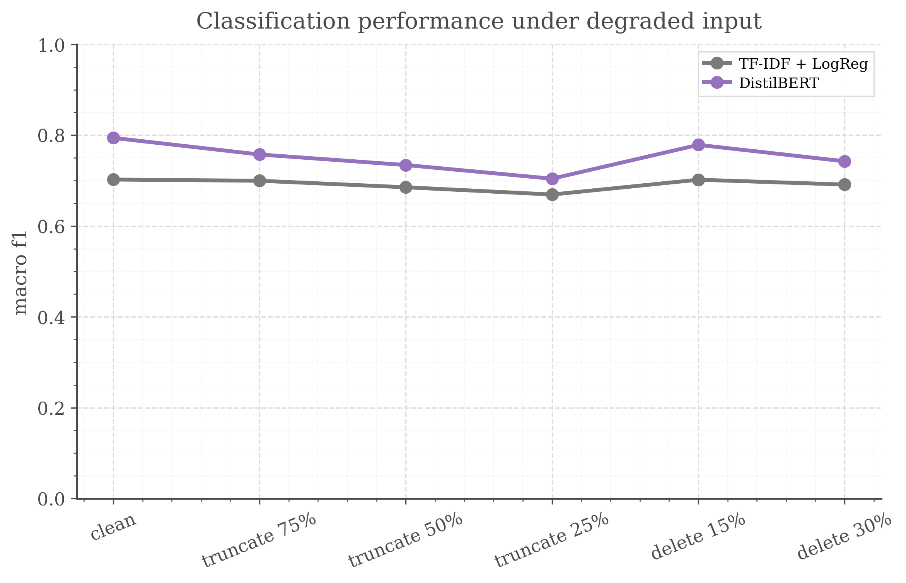
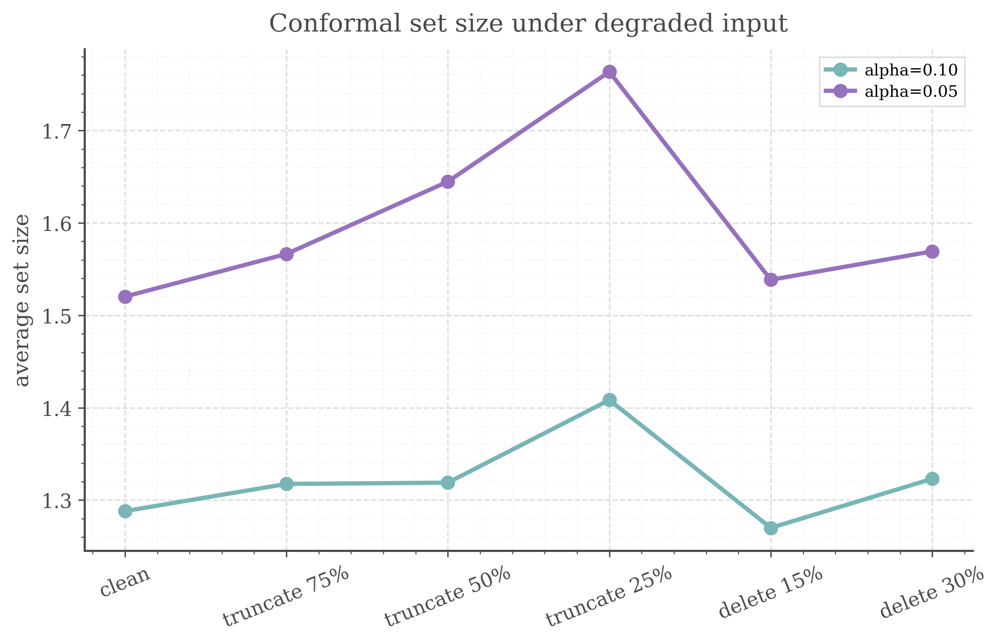

# Uncertainty-Aware Transformer Stress Classification under Degraded Input

A reproducible project on **transformer-based text classification with conformal prediction** under **incomplete or degraded input conditions**.

The project uses the **Dreaddit** dataset for binary stress classification and compares strong lexical baselines against a fine-tuned **DistilBERT** classifier. On top of the transformer, it adds a **split conformal prediction** layer to study how uncertainty-aware outputs behave when the input text is truncated or corrupted. The goal is not benchmark maximisation, but a clean methodological study of **context-sensitive text modelling**, **uncertainty-aware prediction**, and **robust evaluation under non-ideal conditions**.

---

## Motivation of this study

In realistic text processing settings, inputs are often incomplete, noisy, or partially missing. In such settings, it is not enough to report a single clean-test accuracy number. A useful model should also be evaluated under degraded conditions and should be able to express uncertainty rather than always forcing a single confident label.

This project is a methodological study built around three questions:

1. How much does a transformer improve over strong lexical baselines on stress classification?
2. What happens when the test input is truncated or corrupted?
3. Can conformal prediction provide a more cautious output layer under degraded input?

This is a **mental-health-adjacent proxy task**, not a clinical deployment study.

---

## Dataset and Task

**Dataset:** Dreaddit (datasets/asmaab/dreaddit)

**Task:** binary text classification (`stress` vs `not_stress`)

Dreaddit contains long-form Reddit posts annotated for stress. It is a useful public proxy task for studying text classification under incomplete input because the posts are long enough for truncation and corruption stress tests to be meaningful.

---

## Experiment Design

### Models
- **TF-IDF + Logistic Regression**
- **TF-IDF + Linear SVM**
- **DistilBERT** fine-tuned for sequence classification

### Uncertainty Layer
- **Split conformal prediction**
- Applied **only** to the transformer outputs
- Uses a held-out **calibration split**
- Reports:
  - empirical coverage
  - average prediction set size
  - singleton rate
  - empty/full set rates

### Stress Tests
The test set is evaluated under:
- `clean`
- `truncate_75`
- `truncate_50`
- `truncate_25`
- `delete_15`
- `delete_30`

where truncation keeps only the first fraction of the text, and deletion randomly removes a fraction of words.

---

## Main Results

### Clean test performance
The transformer substantially outperforms both lexical baselines on the clean test set.

- **Best baseline (TF-IDF + Logistic Regression)**
  - Accuracy: **0.706**
  - Macro-F1: **0.702**

- **DistilBERT**
  - Accuracy: **0.796**
  - Macro-F1: **0.794**

This is a clear gain for a compact transformer setup on a relatively small dataset.


### Performance under degraded input
Performance drops for all models under information loss, but the transformer remains best across all stress settings.

At the same time, the transformer’s advantage narrows under severe truncation:
- `clean test`:
  - baseline macro-F1: **0.702**
  - DistilBERT macro-F1: **0.794**
- `truncate_25`:
  - baseline macro-F1: **0.669**
  - DistilBERT macro-F1: **0.704**

This suggests that the stronger contextual model benefits more from full input, but also loses more when substantial context is removed.



### Conformal prediction under degraded input
On the clean test set, split conformal prediction reaches the target coverage up to sampling noise:

| alpha | 0.10 | 0.05 |
| :--- | :--- | :--- |
| target coverage | 90 % | 95 % |
| empirical coverage | 0.894 | 0.948 |
| average set size | 1.288 | 1.520 |
| singleton rate | 0.712 | 0.480 |

The split-conformal guarantee is marginal: coverage ≥ 1 − alpha holds in expectation over calibration and test draws, so a single test set of 715 examples can land slightly below target (0.894 vs 0.90 is within one standard error, ≈ 0.011).

Under degraded input the guarantee no longer applies: calibration is done on clean text, so calibration and degraded test examples are not exchangeable. Empirically:
- at **alpha = 0.10**, coverage falls below target under every perturbation (**0.867–0.888**, lowest under `truncate_50`);
- at **alpha = 0.05**, coverage stays at or above target (**0.952–0.962**), but mainly because more sets contain both labels (up to **76 %** full sets under `truncate_25`);
- set size grows and the singleton rate drops as degradation gets stronger, most clearly for truncation; mild deletion (`delete_15`) barely changes set size (at alpha = 0.10 it is even slightly smaller than on clean text).

So the conformal layer does become more cautious under degraded input, but this caution is not calibrated to the shift: the clean-data coverage level is not preserved.



---

## Interpretation

Three main observations emerge from this study:

1. **Transformers matter:** a fine-tuned DistilBERT provides a strong improvement over lexical baselines on clean text.
2. **Input quality matters:** truncation is more harmful than mild random deletion, and severe truncation substantially narrows the transformer’s advantage.
3. **Uncertainty matters:** conformal prediction does not “fix” degraded inputs, but it does provide a more cautious output layer as the signal becomes weaker; its coverage guarantee, however, holds only for inputs exchangeable with the clean calibration data.

This is the central methodological point of the project: **evaluation under non-ideal conditions is more informative than clean accuracy alone**.

---

## Repository Structure

```text
dreaddit-conformal-mental-project/
├── configs/
│   └── base.yaml
├── data/
│   └── processed/
│       ├── train.csv
│       ├── calibration.csv
│       ├── validation.csv
│       └── test.csv
├── src/
│   ├── data.py
│   ├── baselines.py
│   ├── transformer.py
│   ├── conformal.py
│   ├── stress_tests.py
│   ├── evaluate.py
│   ├── plots.py
│   └── utils.py
├── scripts/
│   ├── prepare_data.py
│   ├── train_baselines.py
│   ├── train_transformer.py
│   ├── conformal_layer.py
│   ├── stress_tests.py
│   └── make_report_assets.py
├── results/
│   ├── tables/
│   ├── predictions/
│   └── figures/
├── .python-version
├── pyproject.toml
├── uv.lock
└── README.md
```

---

# Reproducibility
This project uses `uv` for environment management.

## Install dependencies
```shell
uv sync
```

## Run the pipeline step-by-step
```shell
uv run python -m scripts.prepare_data
uv run python -m scripts.train_baselines
uv run python -m scripts.train_transformer
uv run python -m scripts.conformal_layer
uv run python -m scripts.stress_tests
uv run python -m scripts.make_report_assets
```

All steps use `configs/base.yaml` by default (seed 42, all hyperparameters); another config can be passed with `--config <path>`.

## Outputs
Key outputs are saved under:
- `results/tables/`
  - clean metrics (baselines, DistilBERT, conformal)
  - stress-test classification metrics
  - stress-test conformal metrics
  - final summary tables (clean performance, stress classification, stress conformal)
- `results/predictions/`
  - per-example predictions of every step
- `results/figures/`
  - clean comparison figure
  - stress-test classification figure
  - conformal figures

Model checkpoints (`results/checkpoints/`, ~260 MB) are not tracked in git and are recreated by the training steps.

## Determinism
Baseline results and DistilBERT clean-split metrics reproduce exactly on reruns. DistilBERT fine-tuning on Apple MPS is not bit-deterministic, so predicted probabilities can drift slightly between runs, shifting some stress-test and conformal numbers in the third decimal.

---

# known issues and to-do list

do comments on repo structure

do something with .ipynb ... don't know what yet ... (probably exploratory data analysis of whole dreaddit)

think about adding a causal layer and how it lays with project

!!! I've made a grammar mistake in naming functions (src/data/def add_basic_text_features) and (src/stress_tests/def add_basic_features) -> text_lengTH and text_lengHT
**I've fixed it** and moved to utils.py , but fixing will change columns naming in data/processed/*.csv , so after dealing with it **I may rerun** whole pipeline to make final version and results will drift a bit and affecting a README summary

---